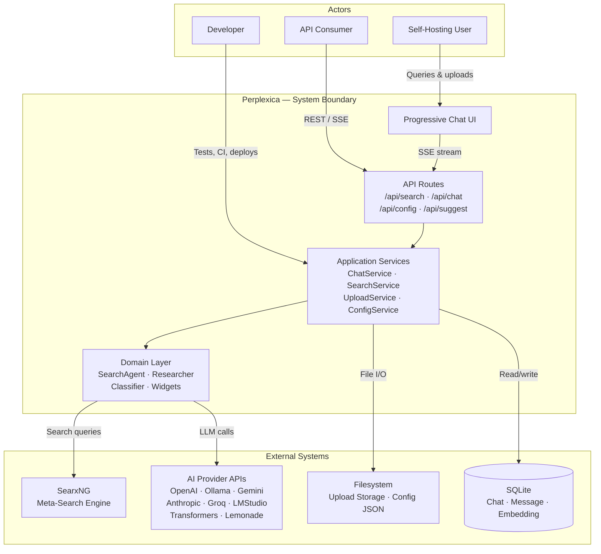
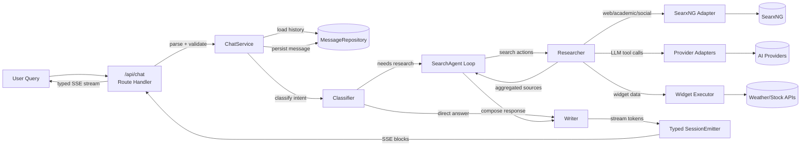
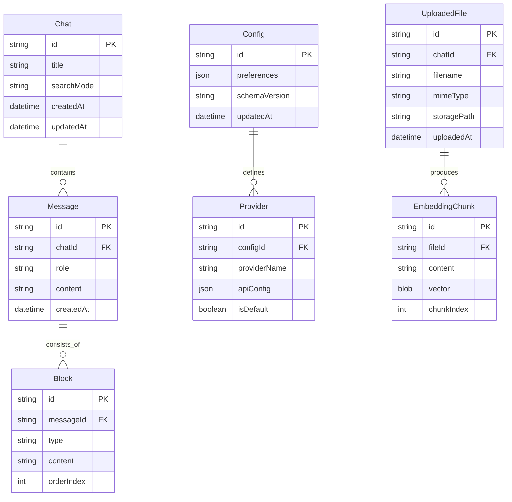
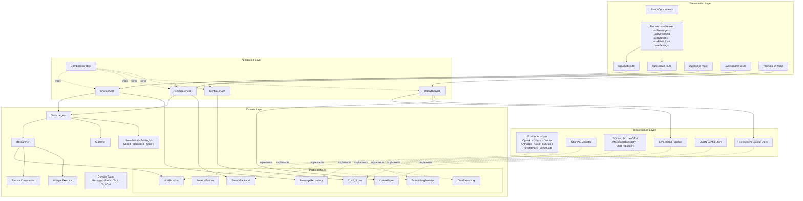
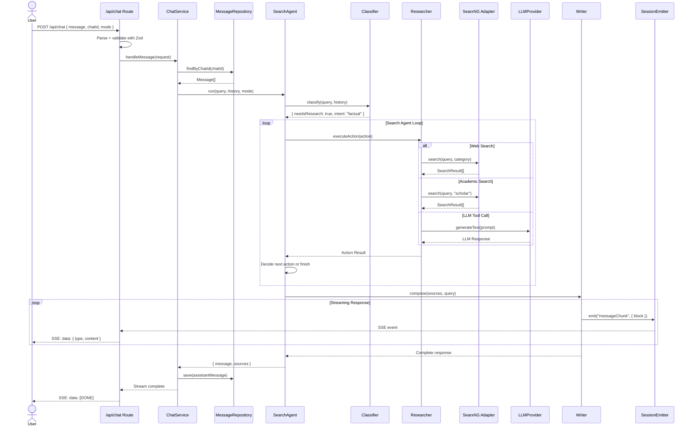

# Diagram-Driven Design

**Status:** Draft

## Layer 0 — Context

System boundary showing actors and external dependencies.

**Actors:**

- **Developer** — Writes tests, runs CI, deploys the application. Interacts with application services and domain layer through injectable ports.
- **Self-Hosting User** — End user issuing natural-language search queries, uploading documents, and consuming streamed responses through the chat UI.
- **API Consumer** — External client calling REST/SSE endpoints directly. Contract must remain backward-compatible (FR-10).

**External Systems:**

- **SearxNG** — Privacy-preserving meta-search engine. Provides web, academic, social, and image search results via REST API. Unreachable SearxNG causes graceful degradation, not system failure.
- **AI Provider APIs** — 8 LLM backends normalized behind a `LLMProvider` port. Provider failures are retried or fallen back to alternates.
- **Filesystem** — Local storage for uploaded documents, parsed text, and JSON configuration. Abstracted behind `UploadStore` and `ConfigStore` ports.
- **SQLite** — Single-file relational store for chats, messages, and embedding vectors. Accessed through repository ports, never directly from domain.

---

## Layer 1 — Data Flows

End-to-end flow of a search query from user request to streamed response.

**Flow description:**

1. User submits a query through the chat UI or API. The route handler parses and validates the request (FR-02), then delegates to `ChatService` (US-3.1).
2. `ChatService` loads chat history via `MessageRepository` (US-4.2) and passes the query to the `Classifier` for intent classification.
3. If research is needed, `SearchAgent` enters its tool-calling loop. The `Researcher` executes search actions (web, academic, social) through the `SearxNGAdapter` and provider adapters (US-2.1, US-2.3).
4. The `Widget Executor` enriches results with structured data (weather, stocks) when relevant.
5. Aggregated sources flow back to the `Writer`, which streams tokens through the typed `SessionEmitter` (US-4.3).
6. The route handler forwards typed SSE blocks to the client. Streaming format and latency are preserved (FR-12).
7. `ChatService` persists the completed message via `MessageRepository`.

---

## Layer 2 — Data Model

Core entities and their relationships.

**Entity notes:**

- **Chat** — Top-level conversation container. Links to all messages in a session. `searchMode` determines which `SearchMode` strategy the agent uses (speed/balanced/quality).
- **Message** — A single turn in a conversation. Role is `user`, `assistant`, or `system`. Content is the full text; structured data lives in child `Block` records.
- **Block** — Progressive rendering unit within a message. Types include `text`, `sources`, `images`, `widget`, `error`. Ordered by `orderIndex` for deterministic streaming assembly (FR-04).
- **Config** — Application-wide configuration. Schema-versioned for safe migration (FR-11). Contains preferences and provider definitions.
- **Provider** — An AI provider configuration entry. Linked to a config. Validated via Zod at creation (US-5.4). The `ModelRegistry` caches live instances keyed by provider ID (US-5.2).
- **UploadedFile** — A user-uploaded document. Linked to a chat for context. Storage path abstracted behind `UploadStore` port.
- **EmbeddingChunk** — A text chunk with its embedding vector. Produced by the `EmbeddingService` pipeline (US-6.3). Used for RAG similarity search.

---

## Layer 3 — Structure / Components

Hexagonal architecture with four layers. Dependencies point inward only.

**Layer rules:**

- **Presentation** depends on Application only. Routes are thin adapters: parse, validate, delegate, serialize (FR-02). React components consume decomposed hooks, each owning a single state concern (FR-07).
- **Application** depends on Domain only. Services orchestrate use cases by coordinating domain objects and port interfaces. No infrastructure imports (FR-14).
- **Domain** has zero outward dependencies. Contains all business logic, port interfaces, and domain types. Testable with no database, filesystem, or network (US-2.1).
- **Infrastructure** implements domain-defined ports. Each adapter is independently testable and replaceable. No adapter imports from Presentation or Application.
- **Composition Root** — Single location wiring adapters to ports and injecting into services (US-2.5). Lives at the application boundary.

---

## Layer 4 — Behavior

Sequence diagram for the primary chat-query flow through the refactored architecture.

**Behavioral notes:**

1. **Request validation** happens at the route boundary using Zod schemas (FR-02, US-3.5). Invalid requests return 400 with typed error details before reaching `ChatService`.
2. **History loading** uses the `MessageRepository` port, enabling in-memory substitution in tests (US-4.2).
3. **Classification** determines whether research is needed and what type. Pure domain logic with no infrastructure access.
4. **Agent loop** iterates until the agent decides to compose a final response. Each action goes through the `Researcher`, which delegates to the appropriate adapter. The loop is fully testable with mock adapters (US-1.5).
5. **Streaming** uses the typed `SessionEmitter` to emit well-defined block events (US-4.3). The route forwards these as SSE to preserve the existing client contract (FR-10, FR-12).
6. **Persistence** happens after streaming completes. The assistant message with all blocks is saved via `MessageRepository`.

---

## Traceability Matrix

| Diagram Element | Layer | Requirement | User Story | Status |
|---|---|---|---|---|
| Composition Root | L3 | FR-01 | US-2.5 | Planned |
| Route Handlers (thin) | L3 | FR-02 | US-3.1, US-3.2, US-3.5 | Planned |
| SearchMode Strategies | L3 | FR-03 | US-8.1, US-8.2, US-8.3, US-8.4 | Planned |
| Typed SessionEmitter | L1, L4 | FR-04 | US-4.3 | Planned |
| Provider Adapters + LLMProvider port | L3 | FR-05 | US-5.1, US-5.2, US-5.3, US-5.4 | Planned |
| UploadService + pipeline stages | L3 | FR-06 | US-6.1, US-6.2, US-6.3, US-6.4, US-6.5 | Planned |
| Decomposed Hooks | L3 | FR-07 | US-7.1, US-7.2, US-7.3 | Planned |
| Domain Types module | L2 | FR-08 | US-7.4 | Planned |
| Test Infrastructure (mocks, harnesses) | L3 | FR-09 | US-1.1, US-1.2, US-1.3, US-1.4, US-1.5 | Planned |
| API Routes (unchanged contract) | L0, L1 | FR-10 | US-3.1, US-3.2 | Planned |
| ConfigService + ConfigStore port | L3 | FR-11 | US-4.1, US-4.4 | Planned |
| SSE streaming path | L1, L4 | FR-12 | US-3.1 | Planned |
| SessionEmitter (typed) | L3, L4 | FR-13 | US-4.3 | Planned |
| Domain Layer (zero infra imports) | L3 | FR-14 | US-2.1, US-2.2 | Planned |
| AppError hierarchy | L3 | FR-15 | US-3.5 | Planned |
| Classifier | L1, L4 | FR-03 | US-8.1 | Planned |
| Researcher | L1, L3 | FR-03 | US-2.3 | Planned |
| SearchAgent loop | L1, L4 | FR-03 | US-2.1 | Planned |
| SearxNG Adapter | L3 | FR-05 | US-2.3 | Planned |
| MessageRepository port | L2, L3 | FR-01 | US-4.2 | Planned |
| Chat entity | L2 | FR-14 | — | Planned |
| Message + Block entities | L2 | FR-04, FR-14 | — | Planned |
| Config + Provider entities | L2 | FR-11 | US-4.1 | Planned |
| UploadedFile + EmbeddingChunk entities | L2 | FR-06 | US-6.4 | Planned |

---

## Final Validation

- [x] All 5 layers exist
- [x] Every requirement has at least one diagram element
- [x] Every user story is covered
- [x] No un-owned data stores or processes
- [x] Tech-stack decisions are still deferred
- [x] Traceability matrix is complete

**Only check this box when ready:** [ ] The design is ready for implementation planning.
